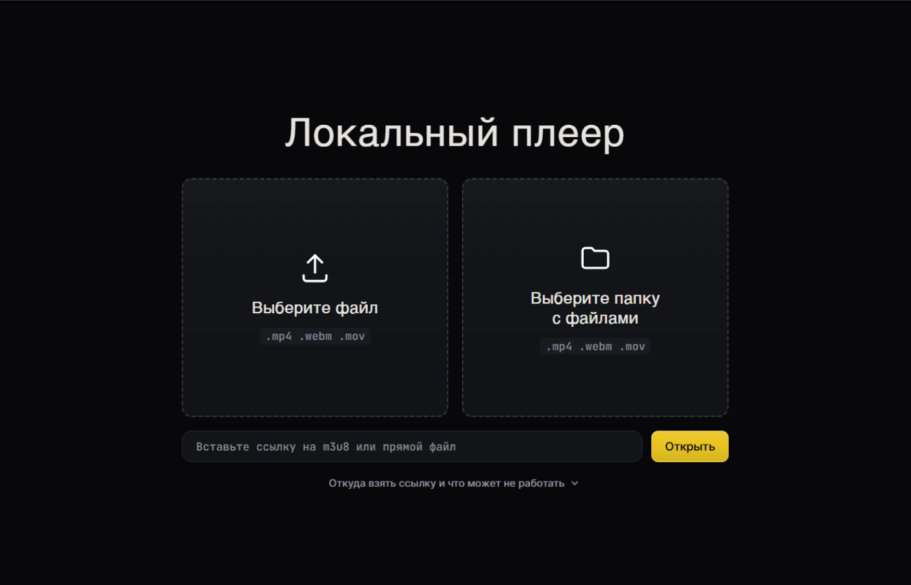
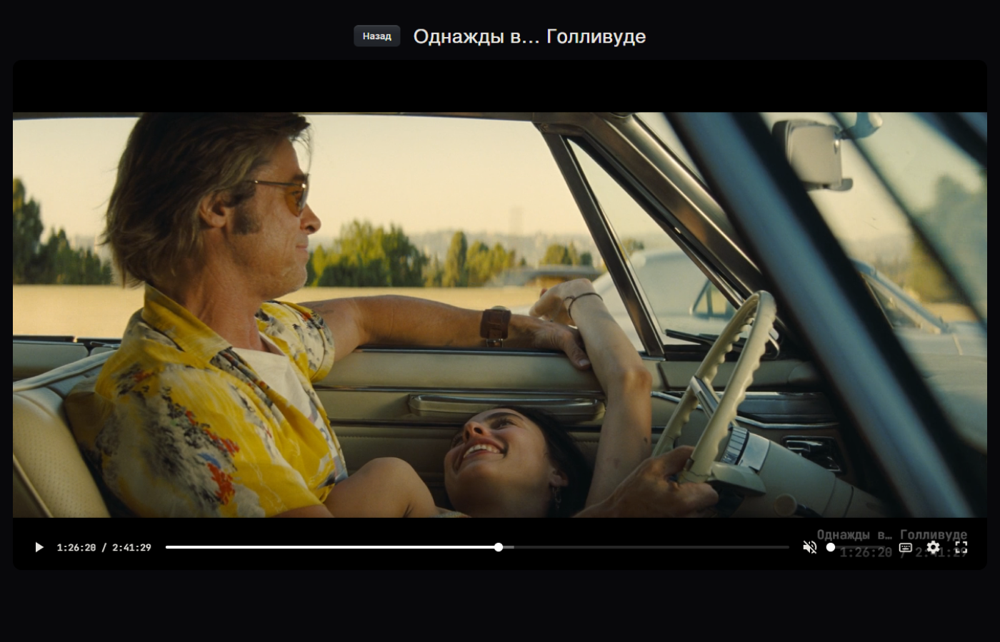
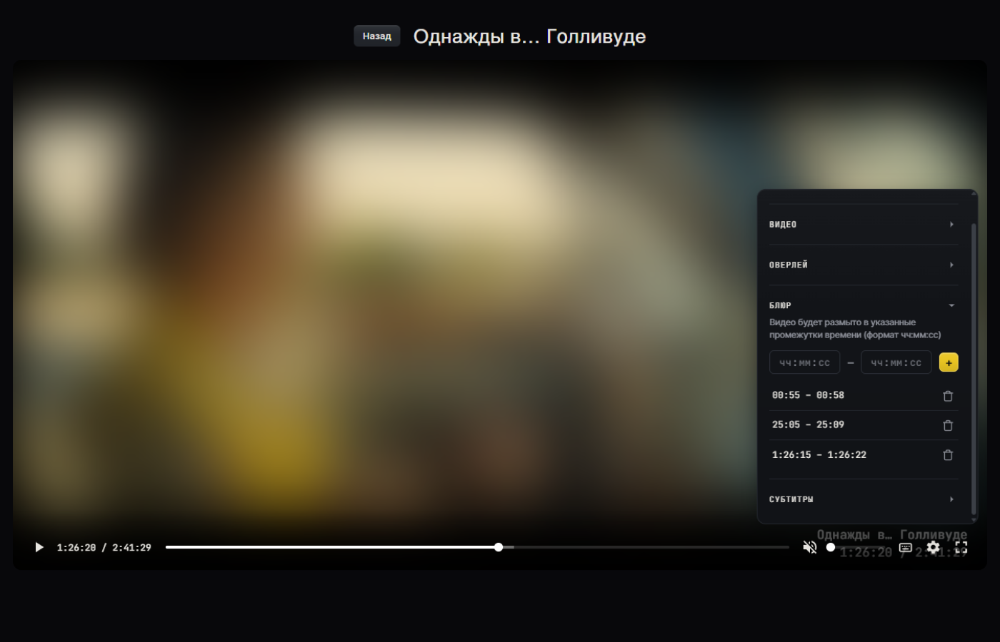
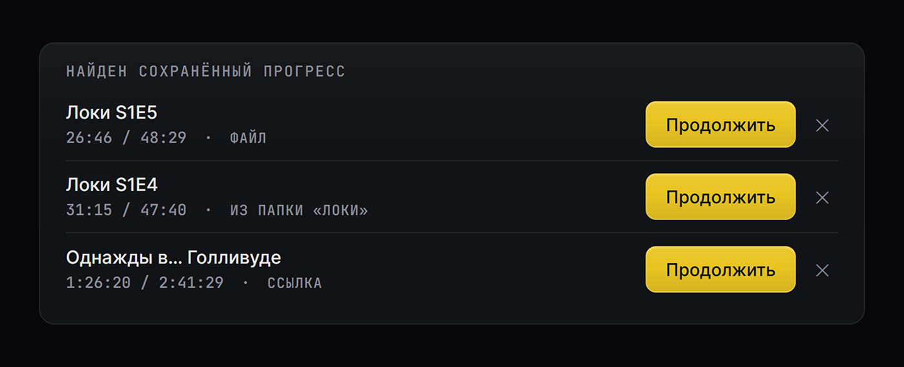

# Локальный плеер

Плеер для видео, которое лежит у вас на диске, и для HLS-ссылок. Никакого сервера, никакого бэкенда

  
  
  
  

  <a href="https://leenmosy.github.io/local-player/"><strong>🎬 Открыть плеер →</strong></a>

  

## Что умеет

- Открывает локальные mp4, webm, mov — файлом или перетаскиванием в окно
- Играет HLS по ссылке на `.m3u8`
- Помнит, где вы остановились, и предложит продолжить с того же места
- Подключает субтитры `.srt` / `.vtt`, можно настроить цвет, фон и прозрачность
- Показывает текст поверх видео — название, тайминг фильма. Гибко настраивается
- Размывает видео в заданных интервалах времени
- Зеркалит картинку и умеет стабилизировать громкость
- Полноэкранный режим

  

## Тонкая настройка

Панель с настройками звука, видео, оверлея и блюра — открывается прямо поверх плеера, не мешая просмотру.

  

Если закрыли плеер на середине — при следующем открытии файла он сам предложит продолжить с того же места:

  

<h2 align="center">Горячие клавиши</h2>

| Клавиша | Действие |
|---|---|
| `Space` | пауза / плей |
| `←` `→` | перемотка на 5 сек |
| `Shift` + `←` `→` | перемотка на 1 сек |
| `↑` `↓` | громкость |
| `M` | выключить звук |
| `F` | полный экран |

## Запуск

Можно просто открыть **[живое демо](https://leenmosy.github.io/local-player/)** — ставить ничего не надо, файлы никуда не загружаются, всё работает локально в вашем браузере.

Или запустить у себя:

1. Клонируете репозиторий (или просто скачиваете)
2. Открываете `index.html` в браузере — подойдёт Chrome, Edge, Firefox
3. Кидаете видео в окно или вставляете ссылку на `.m3u8`

Интернет нужен только чтобы один раз подтянуть [hls.js](https://github.com/video-dev/hls.js) с CDN — ну и для самих HLS-потоков, они по определению из сети.

## Ограничения

Только десктоп/ноутбук, мышь и клавиатура. На сенсорных экранах — заглушка вместо интерфейса.

## Лицензия

**[GNU GPL v3](LICENSE)**. Код можно использовать, менять и распространять, но производные проекты должны оставаться под той же лицензией.
